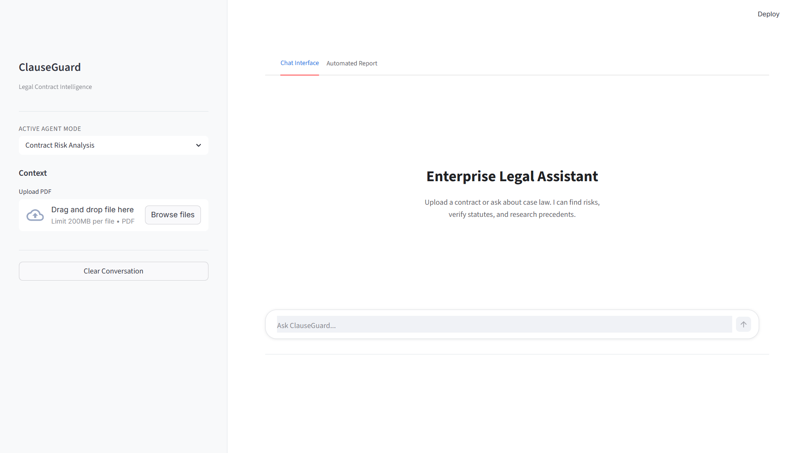

#  ClauseGuard: AI Contract Risk Intelligence

ClauseGuard is a LegalTech application that automates contract review and risk analysis. By utilizing a Mixture of Agents (MoA) architecture, it ingests complex legal documents (including messy, scanned PDFs), extracts dangerous clauses, verifies cited statutes against live government databases, and cross-references recent legal precedents.

What usually takes a senior partner hours of billable time is condensed into a 90-second automated risk dashboard.



---

##  System Architecture: Mixture of Agents (MoA)

ClauseGuard operates on a four-pillar agentic pipeline, orchestrated to resolve conflicts and output a unified risk report:

*    Vision Agent (Llama 4 Vision): The digitizer. Runs OCR on faxed PDFs, handwritten amendments, and stamped signature pages to convert raw images into clean, searchable text.
*    RAG Agent (Llama 3 + ChromaDB): The core pattern matcher. Scans the extracted text to identify high-risk clauses (uncapped liability, unilateral termination, perpetual data licenses) and applies exact inline page citations.
*    Fact Checker (Gemini + Google Grounding): The compliance validator. Actively queries authoritative legal databases to ensure cited statutes and regulations (e.g., GDPR frameworks) are active and have not been superseded.
*    Research Agent (LangGraph + Tavily): The precedent hunter. Executes live web searches to find recent court decisions or FTC rulings that might impact the enforceability of the extracted clauses.

---

##  Tech Stack

*   **Frontend**: Streamlit (Modular UI, decoupled logic)
*   **Backend**: FastAPI, Python
*   **Orchestration**: LangGraph, LangChain
*   **Vector Database**: ChromaDB
*   **Embeddings/Reranking**: Sentence-Transformers (Cross-Encoder)
*   **LLMs**: Gemini 2.0 Flash, Llama 3, Llama 4 Vision

---

##  Project Structure

The repository enforces a strict separation of concerns, dividing the application into independent frontend and backend environments.

```text
ClauseGuard/
├── backend/
│   ├── data/                  # Local vector DBs, logs, and temp uploads
│   ├── src/
│   │   ├── api/               # FastAPI routers (v1 endpoints)
│   │   ├── core/              # Configs and exception handling
│   │   ├── db/                # ChromaDB vector store initialization
│   │   ├── llm/               # Agent logic (RAG, Vision, Statute, Researcher)
│   │   ├── services/          # Business logic and document processing
│   │   ├── utils/             # Helpers and text cleaners
│   │   └── main.py            # Backend Entry Point
│   └── requirements.txt       # Backend dependencies
└── frontend/
    ├── src/
    │   ├── core/              # API client for backend communication
    │   ├── modules/           # Modular UI components (chat, sidebar, analyze)
    │   ├── styles/            # Custom CSS
    │   ├── utils/             # Frontend helpers
    │   └── app.py             # Frontend Entry Point
    └── requirements.txt       # Frontend dependencies
```

---

##  Prerequisites
* **Python 3.10+**
* API Keys for **Google Gemini** and **Groq**
* **Tavily** account for live legal research

---

##  Getting Started

### 1. Clone the Repository

```bash
git clone https://github.com/yourusername/clauseguard.git
cd clauseguard
```

### 2. Backend Setup

Navigate to the backend, set up the virtual environment, and start the FastAPI server:

**For Windows (PowerShell):**
```powershell
cd backend
python -m venv venv
.\venv\Scripts\Activate.ps1
pip install -r requirements.txt

# Start the backend server
uvicorn src.main:app --reload
```

**For macOS/Linux:**
```bash
cd backend
python3 -m venv venv
source venv/bin/activate
pip install -r requirements.txt

# Start the backend server
uvicorn src.main:app --reload
```

### 3. Frontend Setup

Open a new terminal window, navigate to the frontend, and start the Streamlit UI:

**For Windows (PowerShell):**
```powershell
cd frontend
python -m venv venv
.\venv\Scripts\Activate.ps1
pip install -r requirements.txt

# Start the frontend UI
streamlit run src/app.py
```

**For macOS/Linux:**
```bash
cd frontend
python3 -m venv venv
source venv/bin/activate
pip install -r requirements.txt

# Start the frontend UI
streamlit run src/app.py
```
*(Note: Ensure you run `src/app.py` as it acts as the primary orchestrator.)*

### 4. Environment Variables

Create a `.env` file in the `backend/` directory and add your API keys:

```env
# Required for Fact Checker & Core Reasoning
GOOGLE_API_KEY="your_gemini_key_here"

# Required for RAG & Vision Generation
GROQ_API_KEY="your_groq_key_here"

# Required for Legal Precedent Research
TAVILY_API_KEY="your_tavily_key_here"

# Optional: For LangSmith Observability
LANGCHAIN_TRACING_V2="true"
LANGCHAIN_API_KEY="your_langsmith_key_here"
LANGCHAIN_PROJECT="clauseguard_legal_ai"
```

---

##  Disclaimer

> [!CAUTION]
> **Not Legal Advice**: ClauseGuard is an AI-powered research assistant designed to aid professionals. It does not constitute formal legal counsel. Always consult a qualified attorney before signing binding agreements.
---

##  License
This project is licensed under the MIT License - see the [LICENSE](LICENSE) file for details.
